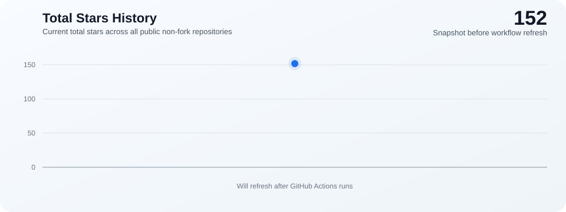

  

<!-- TOTAL-STARS-HISTORY:START -->
## 总星数趋势

  

<!-- TOTAL-STARS-HISTORY:END -->

---

后端 / AI 应用开发者  
想结合 Java 与大模型应用落地；

研究方向：AI 知识库、RAG、LangChain 应用、生成式系统、Agent 架构（LangChain4j）    

熟悉使用 Cursor 、Antigravity、Windsurf、TRAE等AI-IDE

GitHub：https://github.com/STRIVEZSP

---

## 成就 & 活动

---

## 技术标签

### 后端

### Cloud Native & Middleware

### 文档生成 & 日志与监控

### AI & LLM

### 前端

---
---

<!-- PROJECTS-LIST:START -->

### 🆕 最新更新项目

| 项目名 | 简介 | 技术栈 | Stars |
|:--------|:------|:--------|:------|
|  [STRIVEZSP](https://github.com/STRIVEZSP/STRIVEZSP) | 暂无描述 | Python | ⭐ 0 |
|  [pictclub](https://github.com/STRIVEZSP/pictclub) | 暂无描述 | Vue | ⭐ 0 |
|  [STUDYBot](https://github.com/STRIVEZSP/STUDYBot) | 暂无描述 | Java | ⭐ 0 |
|  [AIMovie](https://github.com/STRIVEZSP/AIMovie) | 暂无描述 | Java | ⭐ 0 |

### 🌟 Star 最多项目

| 项目名 | 简介 | 技术栈 | Stars |
|:--------|:------|:--------|:------|
|  [STUDYBot](https://github.com/STRIVEZSP/STUDYBot) | 暂无描述 | Java | ⭐ 0 |
|  [STRIVEZSP](https://github.com/STRIVEZSP/STRIVEZSP) | 暂无描述 | Python | ⭐ 0 |
|  [pictclub](https://github.com/STRIVEZSP/pictclub) | 暂无描述 | Vue | ⭐ 0 |
|  [AIMovie](https://github.com/STRIVEZSP/AIMovie) | 暂无描述 | Java | ⭐ 0 |

> 🕒 最后更新: 2026-06-04 17:36:39 (UTC+8)

<!-- PROJECTS-LIST:END -->

---

## 更多内容

博客：[CSDN](https://blog.csdn.net/weixin_51634706)

> Speak less, do more.
